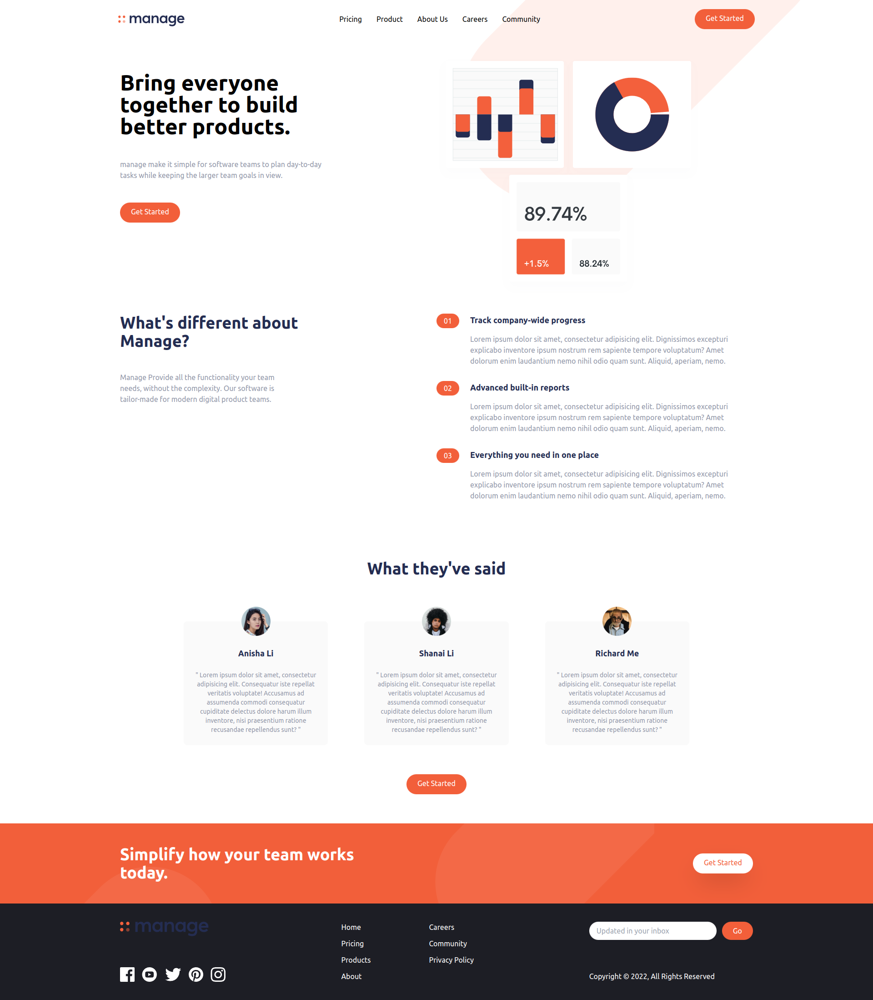

# Basic E-commerce application

This is a landing page to learn how to implement tailwind

## Table of contents

- [Overview](#overview)
    - [Screenshot](#screenshot)
    - [Built with](#built-with)
    - [Libraries](#Libraries)
- [Author](#author)

## Overview

### GIF

(<a href="#top">back to top</a>)

### Built with

* [JavaScript](https://www.javascript.com/)
* [Symantec HTML5 markup](https://developer.mozilla.org/en-US/docs/Glossary/HTML5)
* [CSS custom properties](https://developer.mozilla.org/en-US/docs/Web/CSS)
* 

(<a href="#top">back to top</a>)

### Libraries

* [Tailwind](https://tailwindcss.com/)

(<a href="#top">back to top</a>)

## Author

* LinkedIn - [Abdullah Hegab](https://www.linkedin.com/in/hegab192)

(<a href="#top">back to top</a>)
